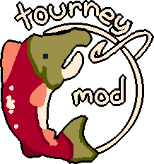

     
	<h3 align="center">The webfishing tournament mod.</h1>

---

Ever wanted to treat fishing in this goddamn game more seriously? Then just do a tourney you dumbass!

# Usage
Make a public or code-only lobby and interact with the tourney station at spawn. At least 2 people need to be in the queue.

## Gameplay
At the start of the tourney, everyone gets placed randomly on the map and their goal is to get as much as possible within the 5 minute timeframe. **For now there's no reward/enterance fee because I still gotta figure out how to make it fun and not op.**

# Requirements
The only requirement is literally the [GDWeave](https://github.com/NotNite/GDWeave/tree/main) mod loader.

# Credits
- ZeaTheMays, for the awesome logo on the top.
- [Sulayre](https://github.com/Sulayre), helping with testing.